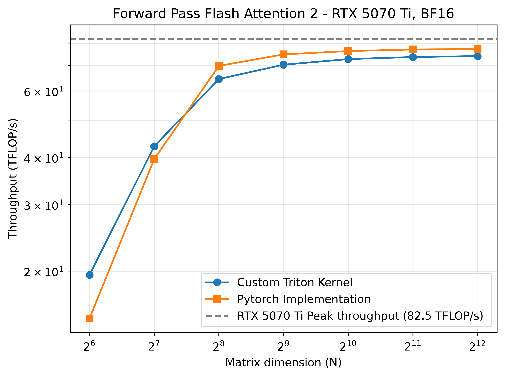
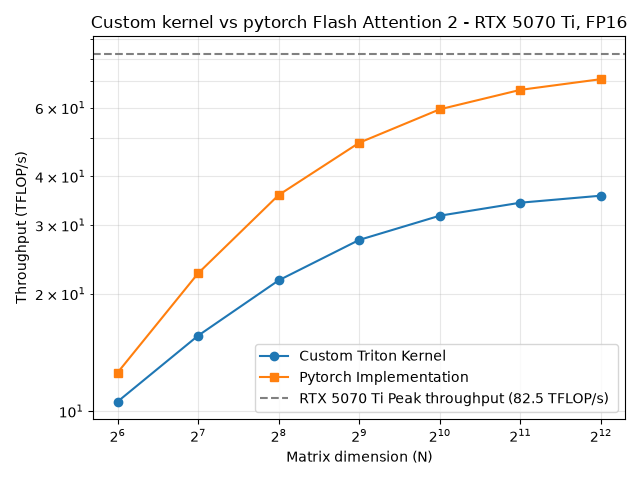
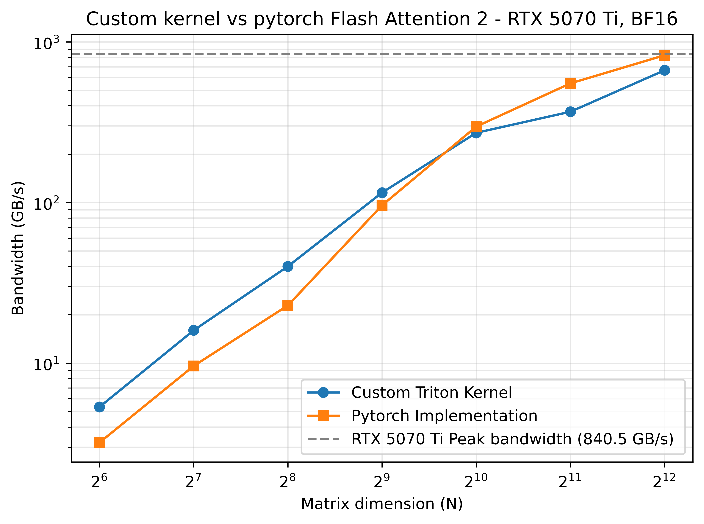

# I/ Results

Comparison between PyTorch's Flash Attention 2 implementation (`F.scaled_dot_product_attention`)
and my Triton kernel.

- **Hardware:** NVIDIA RTX 5070 Ti (Blackwell, 70 SMs, theoretical throughput of FP16
tensor cores with FP32 accumulation with 2.30 GHz clock : `82.5 TFLOP/s`)
- **Precision:** BF16 inputs
- **Dimensions:** Q, K, V of shape `(B, H, N, d)` with `B = H = 32`, `d = 64`.
- **Masking:** none (non-causal) - the full S matrix contributes to the computation
- **Software:** Python `3.13.13`, PyTorch `2.12.0`, Triton `3.7.0`

**Forward Pass benchmark (4-dimensional input tensors):**



**Backward Pass benchmark (4-dimensional input tensors):** 



I will talk about the implementation in 3 steps. First, talk about a forward pass with only 2-dimensional input 
tensors following exactly Tri Dao's algorithm (memory-bound regime). Secondly, detailed explanation about a 
forward pass with 4-dimensional input tensors. Finally, the backward pass with 4-dimensional input tensors.


# II/ 2-dimensional Forward Pass


> *WARNING :* The shape `(1, 1, N, d)` has **a single head**. It is not representative of
> a real workload (where `batch × heads` is in the tens to thousands): it underfills the GPU and forces
> PyTorch into a *split-KV* strategy.



### A) Reading the plot

At small `N`, my kernel edges out PyTorch - most likely because PyTorch takes a *split-KV* path here in
two kernels (partial compute + recombination, see §D) whose overhead isn't amortized when there's
little work, whereas my autotuned kernel runs in a single launch.

From `N ≈ 1024` onward, PyTorch pulls ahead: my kernel is only a direct implementation of Tri Dao's
algorithm, with no further optimization, and leaves performance on the table.

**About the "bandwidth" axis.** The curve plots an *algorithmic* bandwidth: *modeled* bytes
(formula §B) ÷ measured time - **not** the real DRAM traffic, which the hardware caps at 896 GB/s.
This is why the PyTorch curve can "exceed" that ceiling: it simply means PyTorch moves *fewer* real
DRAM bytes than my formula assumes (its K/V tiles are served back from the L2 cache). Profiling
confirms it: on my own kernel, measured DRAM throughput is only **1.25%** - at these sizes,
Q/K/V essentially fit in cache and almost never hit HBM. The "bandwidth" metric is therefore a
throughput indicator, not a measure of memory saturation.

### B) Counting bytes transferred

Notation:
- `B_r`: block size along the rows (queries)
- `d`: hidden dimension shared by Q, K, V
- `N`: number of rows of each matrix (Q, K, V)

Bytes transferred for one *program* (one query block), in BF16 (2 bytes/element):
- load `Q_i` (HBM): `2·B_r·d`
- load all `K_j` (HBM): `2·N·d`
- load all `V_j` (HBM): `2·N·d`
- store `O_i` (HBM): `2·B_r·d`
- store `L_i` (HBM): `2·B_r`

**Total: `4·B_r·d + 4·N·d + 2·B_r`.**

### C) Memory-bound or compute-bound: the idealized roofline

Arithmetic intensity `AI = FLOPs / bytes` places the kernel relative to the roofline's ridge point.

**Ridge point.** The dominant operations are the two matmuls (tensor cores). All measurements in
this repo are taken with the GPU core clock locked at 2.30 GHz (`nvidia-smi -lgc`), where the
BF16-input / FP32-accumulation tensor throughput is `82.5 TFLOP/s` (the advertised `87.9 TFLOP/s`
holds at the 2.45 GHz boost clock). Locking the core clock does not affect memory bandwidth,
which stays at `896 GB/s`. Hence:

> ridge point = 82.5 TFLOP/s ÷ 896 GB/s ≈ **92 FLOPs/byte**

(With FP16 accumulation the throughput would double, pushing the ridge point to ~184 FLOPs/byte;
that's not the regime targeted here.)

**Kernel FLOPs.** Only the two matmuls matter; the rest (exp, online-softmax rescaling, index
arithmetic) is `O(B_r·N)`, negligible against `O(B_r·N·d)` as soon as `d ≫ 1`:
- `2·N·B_r·d` for `S = Q·Kᵀ`
- `2·N·B_r·d` for `O += P·V`
- **total: `FLOPs = 4·N·B_r·d`**

**Bytes** (dropping the `2·B_r` term): `4·B_r·d + 4·N·d = 4·d·(B_r + N)`.

Hence:

> `AI = 4·N·B_r·d / (4·d·(B_r + N)) = (B_r·N) / (B_r + N)`

Numerical application (`B_r = 64`, `N = 4096`, `d = 64`): **`AI ≈ 63 FLOPs/byte`**.

Since `63 < 92`, this **idealized model** predicts a memory-bound regime - *provided the kernel
saturates the bandwidth*. Profiling (§D) shows it does not: the kernel saturates **neither** compute
**nor** memory. The roofline therefore describes a bound my kernel doesn't reach, because its real
bottleneck lies elsewhere.
After applying Tri Dao's algorithm to the letter and accepting only 2-dimensional tensors,
we can broaden the scope and make 4-dimensional tensors possible: (B, H, N, d).

# III/ 4-dimensional Forward Pass

After applying Tri Dao's algorithm to the letter on 2-dimensional tensors, I broadened the scope
to 4-dimensional inputs `(B, H, N, d)`.

Before any profiling, let's first benchmark the kernel. Autotuning covers a fairly large range of
`block sizes` and `num_stages`.

Before launching the benchmark, we need to know which regime we're in: even though the algorithm
only has 2 matrix products, §II showed the kernel can be memory-bound.

GPU data (core clock locked at 2.30 GHz, see §II-C - the compute peak drops to `82.5 TFLOP/s`
while memory bandwidth is unaffected, moving the ridge point from 98 at boost clock down to 92):
- Peak bandwidth: `896 GB/s`
- Peak Tensor Cores BF16 with FP32 accumulation: `82.5 TFLOP/s`
- Total bytes transferred (each tensor crossing HBM once): `8·B·H·N·d`
- Total FLOPs: `4·B·H·N·N·d`

Hence `AI = N / 2` - note that AI is a property of the algorithm and does not depend on clock
frequency. Benchmark dimensions: `B = H = 32`, `d = 64`, `N` swept up to `4096`.

At `N = 4096`, `AI = 2048 ≫ 92`: fully compute-bound. The crossover is at `N ≥ 184`, i.e. from
`N = 256` onward for power-of-two sizes.

The benchmark below uses throughput as the comparison axis; the dashed line marks the
`82.5 TFLOP/s` compute peak at the locked clock.


My kernel and the PyTorch implementation are very close. There are a few percentage points of difference between the two.

The dashed line

After this benchmark, which is very encouraging in that there is only a slight difference between the two implementations,
we run a profiling on Nsight Compute to understand what is happening.

| Metric | Value Custom kernel | Value PyTorch |
|---|---|---|
| Compute (SM) throughput | 93.52% | 96.50% |
| Memory throughput | 37.16% | 23.11% |
| DRAM throughput | 4.49% | 4.69% |
| L2 Hit Rate | 96.88% | 94.80% |

The Nsight Compute profiling confirms the trend that we are indeed compute-bound. There is also an interesting fact
that distinguishes the two kernels. The PyTorch kernel has slightly better SM utilization, which partly explains
its slight advantage.

We therefore have a forward kernel that isn't perfectly on par with PyTorch but performs very well.

We can thus move on to the backward, as that is where there are the most gains compared to a basic implementation.


# IV/ 4-dimensional Backward Pass

Same method as §III, adapted to the backward's data movement. As before, this is the algorithmic
count: each tensor is assumed to cross HBM once, repeated tile loads being served from cache.

- Peak bandwidth: `896 GB/s`
- Peak Tensor Cores BF16 with FP32 accumulation (locked 2.30 GHz clock): `82.5 TFLOP/s`
- Total bytes transferred: `24·B·H·N·d`
- Total FLOPs: `10·B·H·N·N·d`

Breakdown of the factor 24 (per tensor of `B·H·N·d` elements, BF16 = 2 bytes, FP32 = 4 bytes):
- Kernel D - load `O` and `dO` (BF16): `2 × 2`
- Backward kernel - load `K` and `V` (BF16): `2 × 2`
- Backward kernel - load `Q` and `dO` (BF16): `2 × 2`
- Backward kernel - atomic add into `dQ` (FP32, write-only as the SASS below shows the return
  value is discarded): `4`
- Backward kernel - store `dK` and `dV` (FP32): `2 × 4`

Two caveats: (i) modeling the atomic as a read-modify-write instead makes `dQ` cost 8 and the
total 28 - the regime conclusion is unchanged; (ii) this counts each `dQ` element once, but the
kernel actually issues one atomic per KV column block (`N / BS_col` per element). Most of that
extra traffic resolves in L2, where atomics are processed, so the DRAM-level estimate stands -
but it foreshadows the atomic bottleneck investigated below.

The factor 10 for FLOPs comes from the 5 matmuls of the FA2 backward (recompute `S = Q·Kᵀ`,
`dV += Pᵀ·dO`, `dP = dO·Vᵀ`, `dQ += dS·K`, `dK += dSᵀ·Q`), each `2·N²·d` per (batch, head).

Hence `AI = 10·N / 24 ≈ 0.42·N`: compute-bound for `N ≥ 221`, i.e. from `N = 256` onward for
power-of-two sizes.


The benchmark is very interesting to read. First, the PyTorch implementation struggles to reach the throughput
peak. To be seen at profiling time whether the kernel is potentially latency-bound. Second, my kernel
is on average two times slower than the PyTorch implementation.

A plausible suspect is the `dQ` atomic adds. Note they cannot cost a full memory round trip: the
SASS below shows the return value is discarded (destination register `RZ`), so the warp does not
wait for the old value to come back. If they stall, it must be through back-pressure on the memory
pipeline when too many atomics are in flight. Let's profile to check.

For this, we profile the following shape: `(32, 32, 4096, 64)`.

First, we obtain several kernels that execute (I do not take into account the
`vectorized_elementwise_kernel` of PyTorch). The three columns come from the Nsight Compute summary.

| Estimated Speedup (%) | Function Name | Duration (ms) |
|---|---|---|
| 5.55% | _kernel_D_fa2 | 1.31 ms |
| 31.69% | _kernel_fa2_backward | 276.91 ms |
| 22.32% | flash_bwd_dot_do_o_kernel | 3.13 ms |
| 7.95% | flash_bwd_dq_dk_dv_loop_seqk_parallel_kernel | 134.81 ms |
| 1.29% | flash_bwd_convert_dq_kernel | 2.09 ms |

Using the profiling summary, we can already see the trend confirmed that my main kernel `_kernel_fa2_backward`
is about 2 times slower than the PyTorch implementation.

Let's analyze the Nsight Compute metrics of my kernel a bit more deeply to see its behavior.

| Metric | Value |
|---|---|
| Compute (SM) throughput | 72.24% |
| Memory throughput | 32.71% |
| L1 Hit Rate | 32.73% |
| L2 Hit Rate | 22.17% |
| DRAM throughput | 2.66% |

The kernel is indeed not memory-bound, but we cannot however claim it is compute-bound either.
`72%` of compute throughput is good but not sufficient to say that compute is the limiting factor here.

Latency may potentially be the problem but few metrics allow us to make sure that is indeed the case.
However, in Nsight Compute, it is indicated that we have warp stalls.

We can therefore look at the SASS source code to see which instructions stall.

We observe that the following Global Atomic instructions are responsible for an average stall of 11%:
```
ATOMG.E.ADD.F32*4.FTZ.RN.STRONG.GPU PT, RZ, desc[UR16][R112.64], R148
```

These atomics are issued once per (row tile × KV column block), and NCU attributes an average 11%
of stalls to them . They are part of the problem - but the kernel table above shows PyTorch 
also accumulates `dQ` in FP32 (hence its `flash_bwd_convert_dq_kernel`), so atomics alone 
cannot explain the 2× gap.