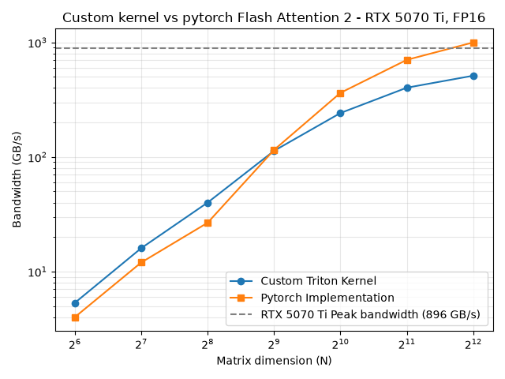

# fa2-triton-study

Implementation of Flash Attention 2 in Triton kernels to better understand how it works.

## I/ Results

Comparison between PyTorch's Flash Attention 2 implementation (`F.scaled_dot_product_attention`)
and my Triton kernel.

- **Hardware:** NVIDIA RTX 5070 Ti (Blackwell, 70 SMs, theoretical HBM bandwidth 896 GB/s)
- **Precision:** BF16 inputs
- **Dimensions:** Q, K, V of shape `(N, d)` with `d = 64`, i.e. `(1, 1, N, d)` in FA2 layout
- **Masking:** none (non-causal) - the full S matrix contributes to the computation

> ** WARNING : Benchmark caveat.** The shape `(1, 1, N, d)` has **a single head**. It is not representative of
> a real workload (where `batch × heads` is in the tens to thousands): it underfills the GPU and forces
> PyTorch into a *split-KV* strategy (see §D). A multi-head benchmark is planned (§E).

### A) Reading the plot

At small `N`, my kernel edges out PyTorch - most likely because PyTorch takes a *split-KV* path here in
two kernels (partial compute + recombination, see §D) whose overhead isn't amortized when there's
little work, whereas my autotuned kernel runs in a single launch.

From `N ≈ 1024` onward, PyTorch pulls ahead: my kernel is only a direct implementation of Tri Dao's
algorithm, with no further optimization, and leaves performance on the table (see the profiling in §D).

**About the "bandwidth" axis.** The curve plots an *algorithmic* bandwidth: *modeled* bytes
(formula §B) ÷ measured time - **not** the real DRAM traffic, which the hardware caps at 896 GB/s.
This is why the PyTorch curve can "exceed" that ceiling: it simply means PyTorch moves *fewer* real
DRAM bytes than my formula assumes (its K/V tiles are served back from the L2 cache). Profiling
confirms it: on my own kernel, measured DRAM throughput is only **1.25%** (§D) - at these sizes,
Q/K/V essentially fit in cache and almost never hit HBM. The "bandwidth" metric is therefore a
throughput indicator, not a measure of memory saturation.

### B) Counting bytes transferred

Notation:
- `B_r`: block size along the rows (queries)
- `d`: hidden dimension shared by Q, K, V
- `N`: number of rows of each matrix (Q, K, V)

Bytes transferred for one *program* (one query block), in BF16 (2 bytes/element):
- load `Q_i` (HBM): `2·B_r·d`
- load all `K_j` (HBM): `2·N·d`
- load all `V_j` (HBM): `2·N·d`
- store `O_i` (HBM): `2·B_r·d`
- store `L_i` (HBM): `2·B_r`

**Total: `4·B_r·d + 4·N·d + 2·B_r`.**

### C) Memory-bound or compute-bound: the idealized roofline

Arithmetic intensity `AI = FLOPs / bytes` places the kernel relative to the roofline's ridge point.

**Ridge point.** The dominant operations are the two matmuls (tensor cores). For a standard BF16
attention (BF16 inputs, FP32 accumulation - the usual FA2 configuration), the card's tensor throughput
is 87.9 TFLOP/s, hence:

> ridge point = 87.9 TFLOP/s ÷ 896 GB/s ≈ **98 FLOPs/byte**

(With FP16 accumulation the throughput would be ~176 TFLOP/s, i.e. ~196 FLOPs/byte; that's not the
regime targeted here.)

**Kernel FLOPs.** Only the two matmuls matter; the rest (exp, online-softmax rescaling, index
arithmetic) is `O(B_r·N)`, negligible against `O(B_r·N·d)` as soon as `d ≫ 1`:
- `2·N·B_r·d` for `S = Q·Kᵀ`
- `2·N·B_r·d` for `O += P·V`
- **total: `FLOPs = 4·N·B_r·d`**

**Bytes** (dropping the `2·B_r` term): `4·B_r·d + 4·N·d = 4·d·(B_r + N)`.

Hence:

> `AI = 4·N·B_r·d / (4·d·(B_r + N)) = (B_r·N) / (B_r + N)`

Numerical application (`B_r = 64`, `N = 4096`, `d = 64`): **`AI ≈ 63 FLOPs/byte`**.

Since `63 < 98`, this **idealized model** predicts a memory-bound regime - *provided the kernel
saturates the bandwidth*. Profiling (§D) shows it does not: the kernel saturates **neither** compute
**nor** memory. The roofline therefore describes a bound my kernel doesn't reach, because its real
bottleneck lies elsewhere.

### D) Profiling (Nsight Compute, `N = 4096`, `d = 64`)

**My kernel `_kernel_fa2_forward`:**

| Metric | Value |
|---|---|
| Compute (SM) throughput | 67.7% |
| Memory throughput | 13.7% |
| DRAM throughput | 1.25% |
| Occupancy (theoretical = achieved) | 8.33% (4 active warps/SM out of 48) |
| Grid | 64 blocks for 70 SMs → 0.91 wave/SM |
| Dynamic shared memory | 65.5 KB/block |
| Occupancy limiter | **shared memory** (1 block/SM; registers would allow 2) |

**Diagnosis.** The kernel is neither memory-bound (memory 13.7%, DRAM 1.25%) nor compute-saturated
(67.7%): it is **latency-bound**. With only 4 active warps per SM, there aren't enough warps in flight
to hide the latency of the `tl.dot` calls and the loads, nor to saturate either pipe. The 8.33%
occupancy is capped by **shared memory** (65.5 KB/block ⇒ a single block per SM; Nsight estimates a
~92% local speedup potential from lifting this constraint).

On top of that, the GPU is **underfilled**: the grid holds only 64 blocks for 70 SMs (0.91 wave/SM),
so some SMs stay idle (Nsight flags a workload imbalance, minimum instance at −100% of the average).
This is a direct consequence of the single-head `(1, 1, N, d)` shape.

**PyTorch (`flash_fwd_splitkv_kernel` + `flash_fwd_splitkv_combine_kernel`).** PyTorch uses a
*split-KV* (Flash-Decoding) strategy in two kernels: lacking `batch × heads` parallelism (here = 1),
it splits the K/V dimension to keep the SMs busy, then recombines the partial results. Its main kernel
measures compute 71.0% / memory 29.4% - more efficient than mine on both axes, hence the gap at
large `N`.

### E) Limitations and next steps

- **Non-representative single-head benchmark.** Redo it with a realistic `batch × heads`
  (e.g. `B = 8, H = 16`): PyTorch will fall back to its standard kernel (no split-KV) and the
  comparison will be fairer.
- **Batching `(B, H, N, d)`** via a `B·H` grid dimension (the kernel's 2D core stays unchanged):
  fills the grid and makes occupancy exploitable.
- **Matmul precision.** The kernel currently up-converts Q/K/V to FP32 before `tl.dot`, so the matmuls
  run in FP32/TF32, not BF16. This lowers the real compute ceiling below the 98 FLOPs/byte of the BF16
  roofline, and doubles the shared-memory footprint of the tiles - likely contributing to the
  1-block/SM occupancy cap. Keeping Q/K/V in BF16 for the matmuls (FP32 accumulation via `tl.dot`) is
  a direct lever.
- **Occupancy.** Sweep `num_warps` (4 → 8) and `num_stages`; reduce per-block shared memory to fit a
  2nd block/SM.
- **Measured roofline.** Plot achieved TFLOP/s against the two ceilings rather than an algorithmic
  bandwidth.
